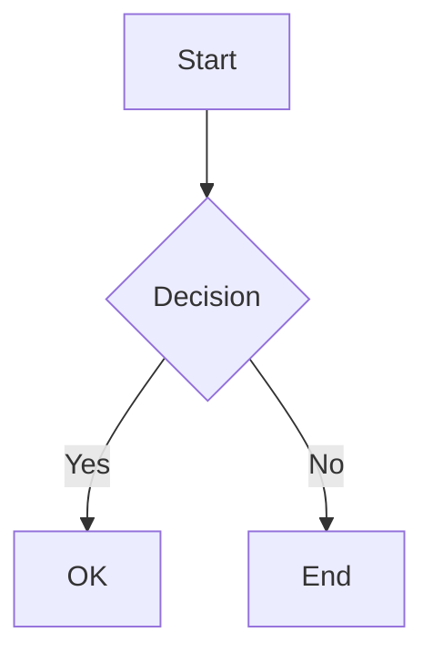

# Xihuai Wang’s Website

[](https://github.com/xihuai18/xihuai18.github.io/actions/workflows/deploy.yml)

Source code for: **https://xihuai18.github.io**

A personal academic website built with [Jekyll](https://jekyllrb.com/) and the [al-folio](https://github.com/alshedivat/al-folio) theme.

---

## Table of Contents

- [Xihuai Wang’s Website](#xihuai-wangs-website)
  - [Table of Contents](#table-of-contents)
  - [Quick Start](#quick-start)
    - [Run with Docker (Recommended)](#run-with-docker-recommended)
    - [Run with Ruby](#run-with-ruby)
  - [Project Structure](#project-structure)
  - [Pages Overview](#pages-overview)
  - [Content Editing Guide](#content-editing-guide)
    - [Site Settings](#site-settings)
    - [Blog Posts](#blog-posts)
    - [Publications](#publications)
    - [CV](#cv)
    - [News](#news)
  - [Writing Features](#writing-features)
    - [Math \& Code](#math--code)
    - [Diagrams](#diagrams)
    - [Images](#images)
    - [Bilingual Posts](#bilingual-posts)
    - [Advanced Features](#advanced-features)
  - [Blog Features](#blog-features)
    - [Filtering \& Archives](#filtering--archives)
    - [Table of Contents](#table-of-contents-1)
    - [Reading Time \& Related Posts](#reading-time--related-posts)
  - [SEO \& Social](#seo--social)
    - [Open Graph \& Twitter Cards](#open-graph--twitter-cards)
    - [Sitemap \& Robots](#sitemap--robots)
  - [Deployment \& CI/CD](#deployment--cicd)
    - [Workflows](#workflows)
    - [Build Pipeline](#build-pipeline)
    - [Manual Deploy](#manual-deploy)
  - [Optional Features](#optional-features)
    - [Feature Toggles](#feature-toggles)
    - [Additional Features](#additional-features)
    - [GA4 Page View Tracking](#ga4-page-view-tracking)
  - [Data Files](#data-files)
  - [Credits \& License](#credits--license)

---

## Quick Start

### Run with Docker (Recommended)

```bash
git clone https://github.com/xihuai18/xihuai18.github.io.git
cd xihuai18.github.io
docker-compose up
```

Open **http://localhost:10086** — the site auto-reloads on file changes.

### Run with Ruby

```bash
bundle install
bundle exec jekyll serve --watch --livereload
```

Open **http://localhost:4000**

---

## Project Structure

```
├── _config.yml          # Site configuration
├── _pages/              # Top-level pages (about, blog, cv, publications)
├── _posts/              # Blog posts (YYYY-MM-DD-slug.md)
├── _news/               # News/announcements
├── _bibliography/       # BibTeX files for publications
│   └── papers.bib
├── _data/
│   ├── cv.yml           # CV data
│   ├── coauthors.yml    # Co-author links
│   ├── repositories.yml # GitHub repos to display
│   └── post_uv.json     # Page view counts (auto-generated)
├── assets/
│   ├── img/             # Images
│   ├── pdf/             # PDFs (papers, slides, etc.)
│   └── js/              # JavaScript
├── _layouts/            # Page templates
├── _includes/           # Reusable components
├── _plugins/            # Custom Jekyll plugins
├── _sass/               # Stylesheets
└── scripts/             # Build scripts (OG image compression, GA4 export)
```

---

## Pages Overview

| Page             | URL              | Description                                             | Edit                                                 |
| ---------------- | ---------------- | ------------------------------------------------------- | ---------------------------------------------------- |
| **Home/About**   | `/`              | Bio, selected papers, news, social links                | [_pages/about.md](_pages/about.md)                   |
| **Blog**         | `/blog/`         | Post list with filters, bilingual switcher, view counts | [_pages/blog.md](_pages/blog.md)                     |
| **Publications** | `/publications/` | Auto-generated from BibTeX, grouped by year             | [_bibliography/papers.bib](_bibliography/papers.bib) |
| **CV**           | `/cv/`           | Rendered from YAML data                                 | [_data/cv.yml](_data/cv.yml)                         |
| **News**         | `/news/`         | Individual announcements                                | [_news/](_news/)                                     |

---

## Content Editing Guide

### Site Settings

Edit [_config.yml](_config.yml):

| Setting                                   | Description                  |
| ----------------------------------------- | ---------------------------- |
| `title`, `first_name`, `last_name`        | Site title and author name   |
| `email`, `description`, `keywords`        | Contact and SEO              |
| `github_username`, `scholar_userid`, etc. | Social links                 |
| `google_analytics`                        | GA4 measurement ID           |
| `og_image`                                | Default social preview image |

### Blog Posts

Create `_posts/YYYY-MM-DD-slug.md`:

```yaml
---
layout: post
title: "Post Title"
date: 2025-01-01
description: "Short description"
categories: category-name
tags: [tag1, tag2]
lang: en                    # Language: en or zh
featured: true              # Pin to top of blog
og_image: /assets/img/...   # Custom social preview
# Optional links
zh_url: /path/to/chinese-version.html
zhihu_url: https://zhuanlan.zhihu.com/p/...
wechat_url: https://mp.weixin.qq.com/s/...
# Optional features
sidenotes: true             # Show footnotes in margin
giscus_comments: true       # Enable comments
related_posts: false        # Disable related posts
---

Your content here...
```

### Publications

Edit [_bibliography/papers.bib](_bibliography/papers.bib):

```bibtex
@inproceedings{key2025,
  title     = {Paper Title},
  author    = {Wang, Xihuai and Others},
  booktitle = {Conference},
  year      = {2025},
  % Display options
  selected  = {true},        % Show on homepage
  abbr      = {CONF},        % Badge abbreviation
  % Links (buttons)
  pdf       = {paper.pdf},   % or full URL
  code      = {https://github.com/...},
  arxiv     = {2501.00000},
  slides    = {slides.pdf},
  poster    = {poster.pdf},
  website   = {https://...},
  blog      = {https://...},
  % Content
  abstract  = {Abstract text...},
  bibtex_show = {true},      % Show BibTeX button
  preview   = {image.png},   % Thumbnail in assets/img/publication_preview/
  % Badges
  altmetric = {true},
  dimensions = {true},
}
```

### CV

Edit [_data/cv.yml](_data/cv.yml):

```yaml
- title: Section Title
  type: time_table          # or: map, list, nested_list
  contents:
    - title: Position
      institution: Organization
      year: 2020-2025
      description:
        - Point 1
        - Point 2
```

### News

Create `_news/announcement_N.md`:

```yaml
---
layout: post
title: Announcement Title
date: 2025-01-01
inline: true
---

Content here (supports Markdown and HTML).
```

Configure display in `_config.yml`:

```yaml
news_scrollable: true  # Scrollable list if >3 items
news_limit: 5          # Max items to show (blank = all)
```

---

## Writing Features

### Math & Code

**LaTeX Math** (MathJax):
```markdown
Inline: $E = mc^2$

Block:
$$
\nabla \cdot \mathbf{E} = \frac{\rho}{\varepsilon_0}
$$
```

**Code Blocks** (syntax highlighting):
~~~markdown
```python
def hello():
    print("Hello!")
```
~~~

### Diagrams

**Mermaid**:
~~~markdown

~~~

**Pseudocode**:
~~~markdown
```pseudocode
\begin{algorithm}
\caption{Algorithm Name}
\begin{algorithmic}
\FUNCTION{Name}{$args$}
  \STATE do something
\ENDFUNCTION
\end{algorithmic}
\end{algorithm}
```
~~~

### Images

**Basic image with zoom**:
```liquid

```

**HTML with zoom**:
```html

```

### Bilingual Posts

Pair English and Chinese versions:

| Post                | Front Matter                            |
| ------------------- | --------------------------------------- |
| English (`*-en.md`) | `lang: en` + `zh_url: /path/to/zh.html` |
| Chinese (`*-zh.md`) | `lang: zh` + `en_url: /path/to/en.html` |

The blog page shows a language switcher for paired posts.

### Advanced Features

<details>
<summary><strong>Sidenotes (Margin Notes)</strong></summary>

Add `sidenotes: true` to front matter. Standard footnotes `[^1]` will appear in the margin on desktop.
</details>

<details>
<summary><strong>Distill-Style Layout</strong></summary>

For academic posts with hover citations:

```yaml
---
layout: distill
distill_citations: true
distill_footnotes: true
distill_bibliography: post.bib  # in assets/bibliography/
authors:
  - name: Your Name
    affiliations:
      name: University
---
```

Use `<d-cite key="key"></d-cite>` and `<d-footnote>text</d-footnote>`.
</details>

<details>
<summary><strong>Collapsible Sections</strong></summary>

```liquid

Hidden content with **Markdown** support.



Starts open.

```
</details>

<details>
<summary><strong>Comments (Giscus)</strong></summary>

Configure in `_config.yml`:

```yaml
giscus:
  repo: username/repo
  repo_id: ...
  category: Comments
  category_id: ...
```

Add `giscus_comments: true` to post front matter.
</details>

<details>
<summary><strong>External RSS Import</strong></summary>

Import posts from external feeds:

```yaml
# _config.yml
external_sources:
  - name: medium.com
    rss_url: https://medium.com/@user/feed
```
</details>

<details>
<summary><strong>Code Block Enhancements</strong></summary>

All code blocks automatically include:
- **Copy Button**: One-click copy to clipboard
- **Wrap Toggle**: Switch between wrapped and horizontal scroll modes
- **Syntax Highlighting**: Language-aware coloring (Rouge)
</details>

<details>
<summary><strong>Footnote Hover Preview</strong></summary>

Standard Markdown footnotes `[^1]` show a tooltip preview on hover, so readers don't need to scroll to the bottom.
</details>

<details>
<summary><strong>Publication Venue Filter</strong></summary>

On the Publications page, click any venue badge (e.g., `ICLR`, `NeurIPS`) to filter papers by that venue. Click again to clear the filter.
</details>

---

## Blog Features

### Filtering & Archives

The blog page supports client-side filtering:

- **By Year**: Click year links or use `?year=2025` URL parameter
- **By Category**: Click category links or use `?category=reinforcement-learning`
- **Combined**: `?year=2025&category=reinforcement-learning`

Archives are auto-generated at:
- `/blog/YYYY/` — Posts by year
- `/blog/tag/TAG/` — Posts by tag
- `/blog/category/CATEGORY/` — Posts by category

### Table of Contents

Posts and CV pages automatically display a **collapsible sidebar TOC** on desktop:

- Auto-generated from `h2` and `h3` headings
- Sticky positioning while scrolling
- Collapsible with toggle button
- Supports both English ("Contents") and Chinese ("目录") titles

### Reading Time & Related Posts

**Reading Time**: Automatically calculated (~180 words/min) and displayed on blog listings and post pages.

**Related Posts**: Shown at the bottom of each post by default. Disable per-post:

```yaml
---
related_posts: false
---
```

**Featured Posts**: Pin posts to the top of the blog with cards:

```yaml
---
featured: true
---
```

---

## SEO & Social

### Open Graph & Twitter Cards

Automatic social preview support:

1. **Custom Image**: Set `og_image` in front matter
2. **Auto-Generated**: If no `og_image`, a dynamic preview is generated via [Tailgraph](https://og.tailgraph.com/)
3. **Site Default**: Falls back to `og_image` in `_config.yml`

OG images are automatically compressed during CI build (target: <500KB).

### Sitemap & Robots

- **Sitemap**: Auto-generated at `/sitemap.xml` via `jekyll-sitemap`
- **Robots.txt**: Configured at `/robots.txt`, allows all crawlers
- **Schema.org**: Structured data for better search engine understanding
- **RSS Feed**: Available at `/feed.xml` (enable icon via `rss_icon: true` in config)

---

## Deployment & CI/CD

Hosted on **GitHub Pages** with **GitHub Actions**.

### Workflows

| Workflow                       | Trigger                      | Action                              |
| ------------------------------ | ---------------------------- | ----------------------------------- |
| `deploy.yml`                   | Push to `master`, PR, manual | Build & deploy to `gh-pages`        |
| `ga4-post-uv.yml`              | Called by other workflows    | Export GA4 page views               |
| `daily-refresh-and-deploy.yml` | Daily UTC 00:00              | Refresh GA4 data, deploy if changed |

### Build Pipeline

1. Checkout repository
2. Compress OG images (auto-creates optimized `-og.jpg` versions)
3. Setup Ruby & install gems
4. Build site (`bundle exec jekyll build`)
5. Deploy `_site/` to `gh-pages` branch

### Manual Deploy

**Actions** → **deploy** → **Run workflow**

---

## Optional Features

### Feature Toggles

Configure in `_config.yml`:

```yaml
enable_google_analytics: true   # GA4 tracking
enable_math: true               # MathJax
enable_mermaid: true            # Mermaid diagrams
enable_pseudocode: true         # Pseudocode blocks
enable_darkmode: true           # Dark/light toggle
enable_medium_zoom: true        # Image zoom
enable_progressbar: true        # Reading progress bar
enable_masonry: true            # Project card layout
enable_navbar_social: true      # Social icons in navbar
enable_tooltips: false          # Auto-generate tooltip links
```

### Additional Features

| Feature              | Description                                                    |
| -------------------- | -------------------------------------------------------------- |
| **Dark Mode**        | Toggle via navbar button, respects system preference           |
| **Progress Bar**     | Reading progress indicator at top of page                      |
| **Image Zoom**       | Click images to zoom (Medium-style)                            |
| **Emoji Support**    | GitHub-style emoji via `jemoji` (`:smile:` → 😄)               |
| **Last Updated**     | Footer shows site's last build time (`last_updated: true`)     |
| **Navbar Social**    | Social icons displayed in navigation bar                       |

### GA4 Page View Tracking

Display view counts on blog posts:

1. Create Google Cloud service account with GA4 Data API access
2. Add repository secrets:
   - `GA4_SERVICE_ACCOUNT_KEY` — JSON key content
   - `GA4_PROPERTY_ID` — Property ID (e.g., `123456789`)
   - `GA4_START_DATE` (optional) — Start date for "all time"

The workflow updates `_data/post_uv.json` daily.

---

## Data Files

Configuration data in `_data/`:

| File               | Purpose                                                                 |
| ------------------ | ----------------------------------------------------------------------- |
| `cv.yml`           | CV content (education, experience, publications, etc.)                  |
| `coauthors.yml`    | Auto-link co-authors in publications by last name                       |
| `repositories.yml` | GitHub users/repos to display on pages                                  |
| `post_uv.json`     | Page view counts (auto-generated by GA4 workflow)                       |
| `post_uv_meta.json`| Metadata for page view tracking                                         |

**Co-authors Example** (`coauthors.yml`):

```yaml
"Zhang":
  - firstname: [Weinan, W.]
    url: https://example.com
```

This auto-links "W. Zhang" or "Weinan Zhang" in publication author lists.

**Repositories Example** (`repositories.yml`):

```yaml
github_users:
  - username
github_repos:
  - owner/repo-name
```

---

## Credits & License

- **Theme**: [al-folio](https://github.com/alshedivat/al-folio) (MIT License)
- **Content**: © Xihuai Wang unless stated otherwise
