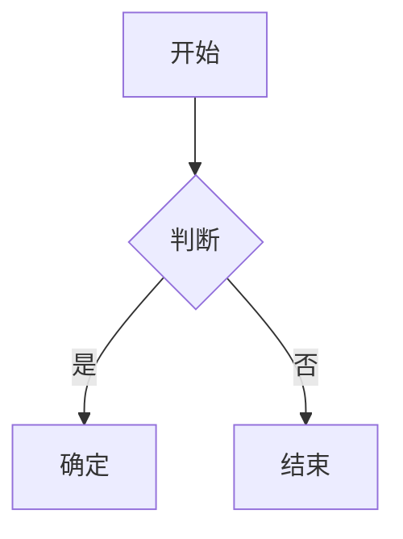

# 王锡淮的个人网站

[](https://github.com/xihuai18/xihuai18.github.io/actions/workflows/deploy.yml)

网站地址：**https://xihuai18.github.io**

基于 [Jekyll](https://jekyllrb.com/) 和 [al-folio](https://github.com/alshedivat/al-folio) 主题构建的个人学术网站。

---

## 目录

- [王锡淮的个人网站](#王锡淮的个人网站)
  - [目录](#目录)
  - [快速开始](#快速开始)
    - [使用 Docker 运行（推荐）](#使用-docker-运行推荐)
    - [使用 Ruby 运行](#使用-ruby-运行)
  - [项目结构](#项目结构)
  - [页面概览](#页面概览)
  - [内容编辑指南](#内容编辑指南)
    - [网站设置](#网站设置)
    - [博客文章](#博客文章)
    - [学术论文](#学术论文)
    - [简历](#简历)
    - [新闻动态](#新闻动态)
  - [写作功能](#写作功能)
    - [数学公式与代码](#数学公式与代码)
    - [图表](#图表)
    - [图片](#图片)
    - [双语文章](#双语文章)
    - [高级功能](#高级功能)
  - [博客功能](#博客功能)
    - [筛选与归档](#筛选与归档)
    - [目录导航](#目录导航)
    - [阅读时间与相关文章](#阅读时间与相关文章)
  - [SEO 与社交分享](#seo-与社交分享)
    - [Open Graph 与 Twitter Cards](#open-graph-与-twitter-cards)
    - [站点地图与爬虫配置](#站点地图与爬虫配置)
  - [部署与 CI/CD](#部署与-cicd)
    - [工作流](#工作流)
    - [构建流程](#构建流程)
    - [手动部署](#手动部署)
  - [可选功能](#可选功能)
    - [功能开关](#功能开关)
    - [附加功能](#附加功能)
    - [GA4 页面访问统计](#ga4-页面访问统计)
  - [数据文件](#数据文件)
  - [致谢与许可](#致谢与许可)

---

## 快速开始

### 使用 Docker 运行（推荐）

```bash
git clone https://github.com/xihuai18/xihuai18.github.io.git
cd xihuai18.github.io
docker-compose up
```

打开 **http://localhost:10086** — 文件修改后网站会自动刷新。

### 使用 Ruby 运行

```bash
bundle install
bundle exec jekyll serve --watch --livereload
```

打开 **http://localhost:4000**

---

## 项目结构

```
├── _config.yml          # 网站配置
├── _pages/              # 顶级页面（关于、博客、简历、论文）
├── _posts/              # 博客文章（YYYY-MM-DD-slug.md）
├── _news/               # 新闻/公告
├── _bibliography/       # 论文 BibTeX 文件
│   └── papers.bib
├── _data/
│   ├── cv.yml           # 简历数据
│   ├── coauthors.yml    # 合作者链接
│   ├── repositories.yml # 展示的 GitHub 仓库
│   └── post_uv.json     # 页面访问量（自动生成）
├── assets/
│   ├── img/             # 图片
│   ├── pdf/             # PDF 文件（论文、幻灯片等）
│   └── js/              # JavaScript
├── _layouts/            # 页面模板
├── _includes/           # 可复用组件
├── _plugins/            # 自定义 Jekyll 插件
├── _sass/               # 样式表
└── scripts/             # 构建脚本（OG 图片压缩、GA4 导出）
```

---

## 页面概览

| 页面     | URL              | 描述                                   | 编辑文件                                             |
| -------- | ---------------- | -------------------------------------- | ---------------------------------------------------- |
| **首页** | `/`              | 个人简介、精选论文、新闻、社交链接     | [_pages/about.md](_pages/about.md)                   |
| **博客** | `/blog/`         | 文章列表，支持筛选、双语切换、访问统计 | [_pages/blog.md](_pages/blog.md)                     |
| **论文** | `/publications/` | 从 BibTeX 自动生成，按年份分组         | [_bibliography/papers.bib](_bibliography/papers.bib) |
| **简历** | `/cv/`           | 从 YAML 数据渲染                       | [_data/cv.yml](_data/cv.yml)                         |
| **新闻** | `/news/`         | 独立公告页面                           | [_news/](_news/)                                     |

---

## 内容编辑指南

### 网站设置

编辑 [_config.yml](_config.yml)：

| 设置项                                 | 描述               |
| -------------------------------------- | ------------------ |
| `title`, `first_name`, `last_name`     | 网站标题和作者姓名 |
| `email`, `description`, `keywords`     | 联系方式和 SEO     |
| `github_username`, `scholar_userid` 等 | 社交链接           |
| `google_analytics`                     | GA4 跟踪 ID        |
| `og_image`                             | 默认社交预览图     |

### 博客文章

创建 `_posts/YYYY-MM-DD-slug.md`：

```yaml
---
layout: post
title: "文章标题"
date: 2025-01-01
description: "简短描述"
categories: 分类名
tags: [标签1, 标签2]
lang: zh                    # 语言：en 或 zh
featured: true              # 置顶到博客顶部
og_image: /assets/img/...   # 自定义社交预览图
# 可选链接
en_url: /path/to/english-version.html
zhihu_url: https://zhuanlan.zhihu.com/p/...
wechat_url: https://mp.weixin.qq.com/s/...
# 可选功能
sidenotes: true             # 在边栏显示脚注
giscus_comments: true       # 启用评论
related_posts: false        # 禁用相关文章
---

正文内容...
```

### 学术论文

编辑 [_bibliography/papers.bib](_bibliography/papers.bib)：

```bibtex
@inproceedings{key2025,
  title     = {论文标题},
  author    = {Wang, Xihuai and Others},
  booktitle = {会议名称},
  year      = {2025},
  % 显示选项
  selected  = {true},        % 在首页显示
  abbr      = {CONF},        % 徽章缩写
  % 链接（按钮）
  pdf       = {paper.pdf},   % 或完整 URL
  code      = {https://github.com/...},
  arxiv     = {2501.00000},
  slides    = {slides.pdf},
  poster    = {poster.pdf},
  website   = {https://...},
  blog      = {https://...},
  % 内容
  abstract  = {摘要文本...},
  bibtex_show = {true},      % 显示 BibTeX 按钮
  preview   = {image.png},   % 缩略图（放在 assets/img/publication_preview/）
  % 徽章
  altmetric = {true},
  dimensions = {true},
}
```

### 简历

编辑 [_data/cv.yml](_data/cv.yml)：

```yaml
- title: 章节标题
  type: time_table          # 或：map, list, nested_list
  contents:
    - title: 职位
      institution: 机构
      year: 2020-2025
      description:
        - 要点 1
        - 要点 2
```

### 新闻动态

创建 `_news/announcement_N.md`：

```yaml
---
layout: post
title: 公告标题
date: 2025-01-01
inline: true
---

公告内容（支持 Markdown 和 HTML）。
```

在 `_config.yml` 中配置显示：

```yaml
news_scrollable: true  # 超过 3 条时显示滚动条
news_limit: 5          # 最多显示条数（留空显示全部）
```

---

## 写作功能

### 数学公式与代码

**LaTeX 数学公式**（MathJax）：
```markdown
行内公式：$E = mc^2$

块级公式：
$$
\nabla \cdot \mathbf{E} = \frac{\rho}{\varepsilon_0}
$$
```

**代码块**（语法高亮）：
~~~markdown
```python
def hello():
    print("你好！")
```
~~~

### 图表

**Mermaid 流程图**：
~~~markdown

~~~

**伪代码**：
~~~markdown
```pseudocode
\begin{algorithm}
\caption{算法名称}
\begin{algorithmic}
\FUNCTION{Name}{$args$}
  \STATE 执行操作
\ENDFUNCTION
\end{algorithmic}
\end{algorithm}
```
~~~

### 图片

**带缩放的基本图片**：

```liquid

```


**HTML 方式（带缩放）**：
```html

```

### 双语文章

配对英文和中文版本：

| 文章             | Front Matter                            |
| ---------------- | --------------------------------------- |
| 英文 (`*-en.md`) | `lang: en` + `zh_url: /path/to/zh.html` |
| 中文 (`*-zh.md`) | `lang: zh` + `en_url: /path/to/en.html` |

博客页面会为配对的文章显示语言切换器。

### 高级功能

<details>
<summary><strong>边栏脚注（Sidenotes）</strong></summary>

在 front matter 中添加 `sidenotes: true`。标准脚注 `[^1]` 会在桌面端显示在边栏。
</details>

<details>
<summary><strong>Distill 风格布局</strong></summary>

适用于带悬浮引用的学术文章：

```yaml
---
layout: distill
distill_citations: true
distill_footnotes: true
distill_bibliography: post.bib  # 放在 assets/bibliography/
authors:
  - name: 你的名字
    affiliations:
      name: 大学
---
```

使用 `<d-cite key="key"></d-cite>` 和 `<d-footnote>文本</d-footnote>`。
</details>

<details>
<summary><strong>可折叠区块</strong></summary>


```liquid

支持 **Markdown** 的隐藏内容。



初始状态为展开。

```

</details>

<details>
<summary><strong>评论系统（Giscus）</strong></summary>

在 `_config.yml` 中配置：

```yaml
giscus:
  repo: username/repo
  repo_id: ...
  category: Comments
  category_id: ...
```

在文章 front matter 中添加 `giscus_comments: true`。
</details>

<details>
<summary><strong>外部 RSS 导入</strong></summary>

从外部源导入文章：

```yaml
# _config.yml
external_sources:
  - name: medium.com
    rss_url: https://medium.com/@user/feed
```
</details>

<details>
<summary><strong>代码块增强</strong></summary>

所有代码块自动包含：
- **复制按钮**：一键复制到剪贴板
- **换行切换**：在自动换行和水平滚动之间切换
- **语法高亮**：基于语言的代码着色（Rouge）
</details>

<details>
<summary><strong>脚注悬浮预览</strong></summary>

标准 Markdown 脚注 `[^1]` 在鼠标悬停时显示工具提示预览，读者无需滚动到页面底部。
</details>

<details>
<summary><strong>论文会议筛选</strong></summary>

在论文页面，点击任意会议徽章（如 `ICLR`、`NeurIPS`）可按该会议筛选论文。再次点击清除筛选。
</details>

---

## 博客功能

### 筛选与归档

博客页面支持客户端筛选：

- **按年份**：点击年份链接或使用 `?year=2025` URL 参数
- **按分类**：点击分类链接或使用 `?category=reinforcement-learning`
- **组合筛选**：`?year=2025&category=reinforcement-learning`

归档页面自动生成：
- `/blog/YYYY/` — 按年份归档
- `/blog/tag/TAG/` — 按标签归档
- `/blog/category/CATEGORY/` — 按分类归档

### 目录导航

文章和简历页面在桌面端自动显示**可折叠的侧边栏目录**：

- 从 `h2` 和 `h3` 标题自动生成
- 滚动时固定定位
- 可通过按钮折叠/展开
- 支持中英文标题（"Contents" / "目录"）

### 阅读时间与相关文章

**阅读时间**：自动计算（约 180 字/分钟），显示在博客列表和文章页面。

**相关文章**：默认显示在每篇文章底部。可按文章禁用：

```yaml
---
related_posts: false
---
```

**置顶文章**：以卡片形式固定在博客顶部：

```yaml
---
featured: true
---
```

---

## SEO 与社交分享

### Open Graph 与 Twitter Cards

自动支持社交预览：

1. **自定义图片**：在 front matter 中设置 `og_image`
2. **自动生成**：如果没有 `og_image`，通过 [Tailgraph](https://og.tailgraph.com/) 动态生成预览图
3. **网站默认**：回退到 `_config.yml` 中的 `og_image`

OG 图片在 CI 构建时自动压缩（目标：<500KB）。

### 站点地图与爬虫配置

- **站点地图**：通过 `jekyll-sitemap` 自动生成于 `/sitemap.xml`
- **Robots.txt**：配置于 `/robots.txt`，允许所有爬虫
- **Schema.org**：结构化数据，提升搜索引擎理解
- **RSS 订阅**：可通过 `/feed.xml` 获取（在配置中设置 `rss_icon: true` 显示图标）

---

## 部署与 CI/CD

托管于 **GitHub Pages**，使用 **GitHub Actions** 自动部署。

### 工作流

| 工作流                         | 触发条件                  | 操作                        |
| ------------------------------ | ------------------------- | --------------------------- |
| `deploy.yml`                   | 推送到 `master`、PR、手动 | 构建并部署到 `gh-pages`     |
| `ga4-post-uv.yml`              | 被其他工作流调用          | 导出 GA4 页面访问量         |
| `daily-refresh-and-deploy.yml` | 每日 UTC 00:00            | 刷新 GA4 数据，有变化时部署 |

### 构建流程

1. 检出仓库
2. 压缩 OG 图片（自动创建优化的 `-og.jpg` 版本）
3. 设置 Ruby 并安装依赖
4. 构建网站（`bundle exec jekyll build`）
5. 将 `_site/` 部署到 `gh-pages` 分支

### 手动部署

**Actions** → **deploy** → **Run workflow**

---

## 可选功能

### 功能开关

在 `_config.yml` 中配置：

```yaml
enable_google_analytics: true   # GA4 跟踪
enable_math: true               # MathJax 数学公式
enable_mermaid: true            # Mermaid 图表
enable_pseudocode: true         # 伪代码块
enable_darkmode: true           # 深色/浅色模式切换
enable_medium_zoom: true        # 图片缩放
enable_progressbar: true        # 阅读进度条
enable_masonry: true            # 项目卡片布局
enable_navbar_social: true      # 导航栏社交图标
enable_tooltips: false          # 自动生成工具提示链接
```

### 附加功能

| 功能           | 描述                                                  |
| -------------- | ----------------------------------------------------- |
| **深色模式**   | 通过导航栏按钮切换，遵循系统偏好                      |
| **进度条**     | 页面顶部的阅读进度指示器                              |
| **图片缩放**   | 点击图片放大（Medium 风格）                           |
| **Emoji 支持** | 通过 `jemoji` 支持 GitHub 风格 emoji（`:smile:` → 😄） |
| **最后更新**   | 页脚显示网站最后构建时间（`last_updated: true`）      |
| **导航栏社交** | 在导航栏显示社交图标                                  |

### GA4 页面访问统计

在博客文章上显示访问量：

1. 创建具有 GA4 Data API 访问权限的 Google Cloud 服务账号
2. 添加仓库密钥：
   - `GA4_SERVICE_ACCOUNT_KEY` — JSON 密钥内容
   - `GA4_PROPERTY_ID` — 属性 ID（如 `123456789`）
   - `GA4_START_DATE`（可选）— "全部时间" 的起始日期

工作流每日更新 `_data/post_uv.json`。

---

## 数据文件

`_data/` 目录中的配置数据：

| 文件                | 用途                                |
| ------------------- | ----------------------------------- |
| `cv.yml`            | 简历内容（教育、经历、论文等）      |
| `coauthors.yml`     | 按姓氏自动链接论文中的合作者        |
| `repositories.yml`  | 要展示的 GitHub 用户/仓库           |
| `post_uv.json`      | 页面访问量（由 GA4 工作流自动生成） |
| `post_uv_meta.json` | 页面访问统计的元数据                |

**合作者示例**（`coauthors.yml`）：

```yaml
"Zhang":
  - firstname: [Weinan, W.]
    url: https://example.com
```

这会自动为论文作者列表中的 "W. Zhang" 或 "Weinan Zhang" 添加链接。

**仓库示例**（`repositories.yml`）：

```yaml
github_users:
  - username
github_repos:
  - owner/repo-name
```

---

## 致谢与许可

- **主题**：[al-folio](https://github.com/alshedivat/al-folio)（MIT 许可证）
- **内容**：© 王锡淮，除非另有说明
